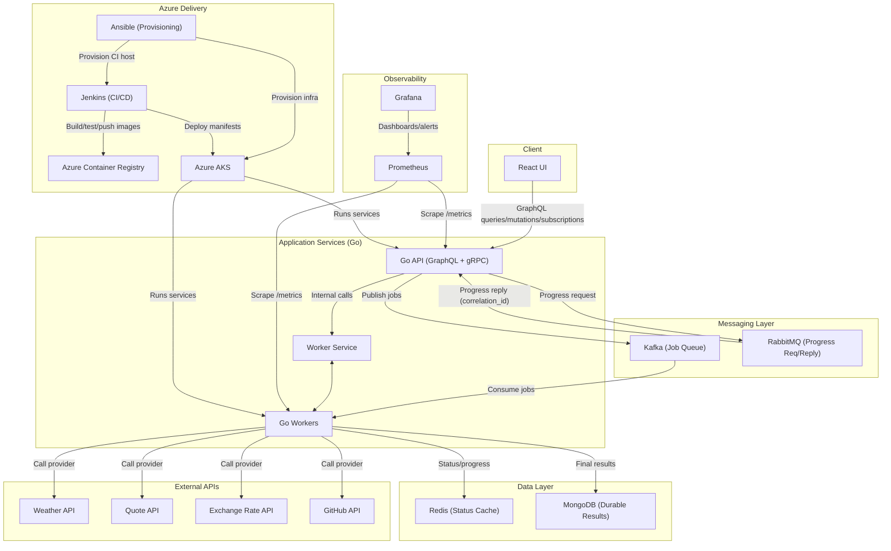

# Distributed-Task-Queue

## Architecture Diagram



A distributed task queue where users submit jobs via a web UI, workers process them, and users can monitor live progress.

## Current Runbook (Completed Through Week 4 Day 20)
Runbooks are split by use case to avoid duplicated instructions:
Use the split runbooks:
- Local app run: `docs/runbooks/local-runbook.md`
- Local validation/testing: `docs/runbooks/local-validation-runbook.md`
- Azure/AKS deployment: `docs/runbooks/azure-runbook.md`

Quick validation entrypoint:

```bash
bash scripts/run-current-e2e.sh --with-ui-checks --purge
```

## Current Layout
- `api/` - Go API with GraphQL mutation/query/subscription surface and Kafka enqueue path
- `worker/` - Go worker Kafka consumer + gRPC status/progress service + RabbitMQ responder compatibility
- `ui/` - React Apollo client UI with GraphQL WebSocket subscriptions
- `infra/compose/` - local Kafka/RabbitMQ/Redis/Mongo stack
- `infra/aks/monitoring/` - Week 4 Prometheus/Grafana AKS manifests
- `contracts/` - Week 1 data contracts + Week 2 gRPC contract
- `docs/` - canonical spec and active week execution plans
- `scripts/` - deterministic local test runners
