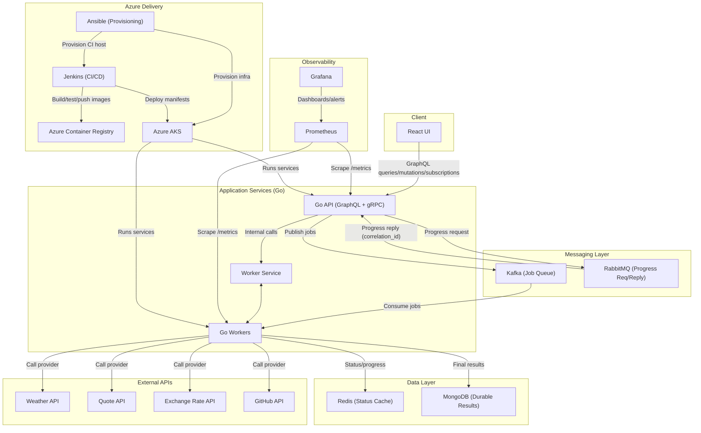
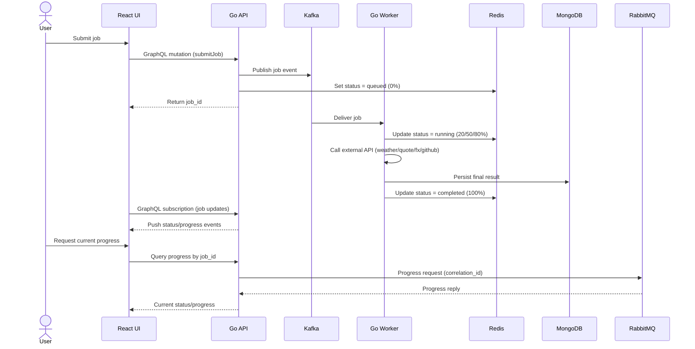

# Distributed-Task-Queue

## Architecture Diagram



### Architecture Summary

- The React UI is the user entry point for job submission and live progress monitoring.
- The Go API exposes the GraphQL surface and orchestrates job lifecycle operations.
- Kafka is the primary asynchronous queue used to decouple job submission from processing.
- Go workers consume Kafka jobs, execute external API calls, and drive progress milestones.
- Redis stores hot job state (`queued`, `running`, `completed/failed`) for fast status reads.
- MongoDB stores durable final outputs and metadata for each job execution.
- RabbitMQ handles request-reply style progress lookups where correlation and acknowledgments matter.
- Prometheus and Grafana provide metrics, dashboards, and alerting for service and queue health.
- Azure delivery uses Ansible + Jenkins + ACR + AKS for provisioning, CI/CD, and runtime hosting.

## Workflow Diagram



### Workflow Explanation

When a user submits a job from the React UI, the API accepts the request and returns a `job_id` immediately so the UI can start tracking progress.  
The API publishes the job to Kafka, which decouples request handling from worker execution and keeps submission responsive under load.  
Workers consume jobs asynchronously, execute the external provider call, and update Redis with milestone progress states during processing.  
Redis acts as the fast source of truth for current status, so progress checks can be served quickly without scanning durable storage.  
Once processing finishes, the worker persists the final result and metadata in MongoDB for durable retrieval and auditing.  
In parallel, the UI receives live updates through GraphQL subscriptions pushed from the API as job state changes occur.  
If a user explicitly asks for current progress, the API uses RabbitMQ request-reply to fetch correlated status data reliably.  
This split design lets Kafka handle high-throughput job ingestion while RabbitMQ handles interactive, correlation-sensitive progress lookups.

## Runbooks
Runbooks are split by use case to avoid duplicated instructions:
Use the split runbooks:
- Local app run: `docs/runbooks/local-runbook.md`
- Local validation/testing: `docs/runbooks/local-validation-runbook.md`
- Azure/AKS deployment: `docs/runbooks/azure-runbook.md`

Quick validation entrypoint:

```bash
bash scripts/run-current-e2e.sh --with-ui-checks --purge
```

## Current Layout
- `api/` - Go API with GraphQL mutation/query/subscription surface and Kafka enqueue path
- `worker/` - Go worker Kafka consumer + gRPC status/progress service + RabbitMQ responder compatibility
- `ui/` - React Apollo client UI with GraphQL WebSocket subscriptions
- `infra/compose/` - local Kafka/RabbitMQ/Redis/Mongo stack
- `infra/aks/monitoring/` - Week 4 Prometheus/Grafana AKS manifests
- `contracts/` - Week 1 data contracts + Week 2 gRPC contract
- `docs/` - canonical spec and active week execution plans
- `scripts/` - deterministic local test runners
